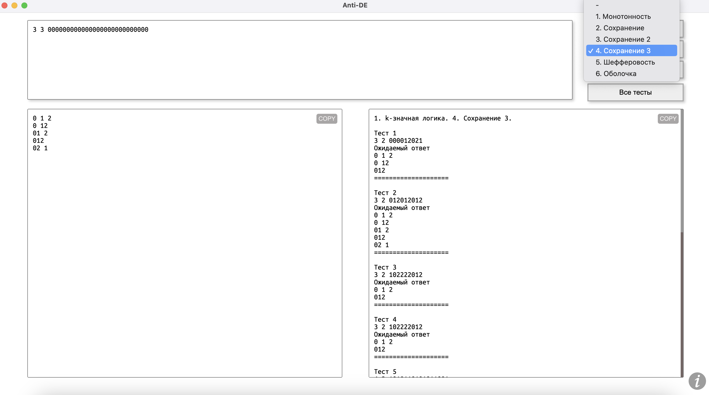

# Anti-de
***
 Project to assist students in writing their lab work for the 1st year, 2nd semester (discrete mathematics).

***

### TODO
* Function analysis (P2): you will be able to input a logical expression, and the program will, for instance, generate a truth table or determine in which predefined classes this function lies;
* Automatic run-through with available tests.